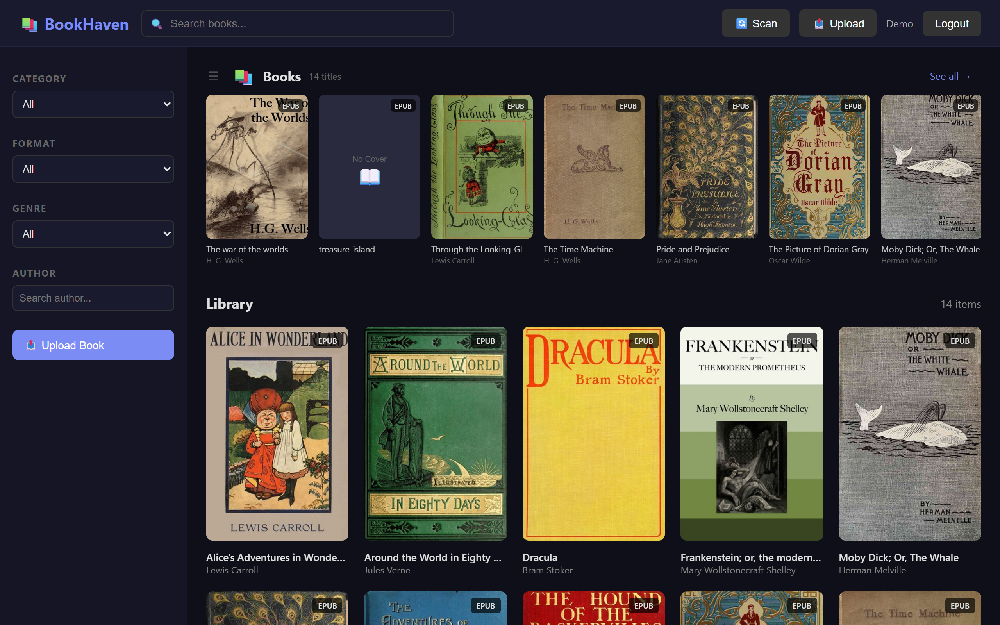
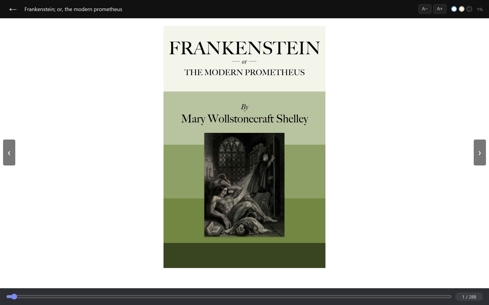
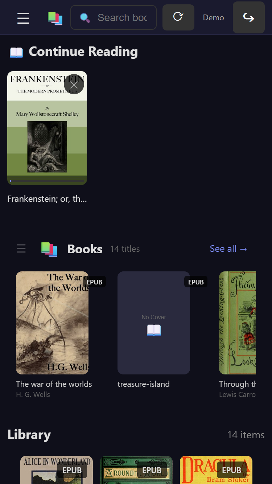

# BookHaven

A self-hosted ebook library server with in-browser readers for **EPUB, PDF,
CBZ/CBR and MOBI**, a companion **Android** client with offline reading and
progress sync, and **local-LLM genre classification**. Point it at a folder of
books, scan, and read from any device on your network.

> Screenshots below are generated from a demo instance seeded exclusively with
> **public-domain books** from [Project Gutenberg](https://www.gutenberg.org/).



## Features

- **Multi-format in-browser readers** — EPUB (epub.js), PDF (PDF.js), comic
  archives CBZ/CBR (extracted page-by-page on the fly), and MOBI. Files are
  streamed from disk with HTTP range requests; no pre-conversion step.
- **Local-LLM genre classification** — books are tagged against a fixed
  taxonomy by a locally-running [Ollama](https://ollama.com/) model
  (`llama3.1`). The prompt is constrained to a closed set of genres with strict
  parsing; if Ollama isn't running, classification is simply skipped. **No book
  data ever leaves the machine.**
- **Asynchronous metadata enrichment** — a background worker extracts covers
  from the files themselves (PyMuPDF / ZIP / RAR / EPUB OPF), then falls back to
  Open Library and Google Books for covers and descriptions. Outbound fetches
  are restricted to public HTTPS hosts (SSRF-guarded).
- **Reading-progress sync** — web ↔ Android, with conflict resolution. EPUB
  position is stored as a precise CFI, not a percentage, so it survives font and
  layout changes.
- **Collections** — series and format variants of the same book are grouped
  entirely in SQL, with a parity test suite against the original Python
  implementation.
- **Responsive UI** — works from phone to desktop, with a "Continue Reading"
  shelf and a full-screen reader.

<p align="center">
  
  
</p>

## Architecture

```
┌───────────────┐   HTTP/JSON   ┌─────────────────────────────┐
│  Web browser  │──────────────▶│  Flask app (bookhaven.py)   │
│ epub.js/PDF.js│               │   ├─ database.py  (SQLite/WAL)
└───────────────┘               │   ├─ scanner.py   (library indexing)
┌───────────────┐               │   ├─ genre_ai.py  ──▶ Ollama (local LLM)
│  Android app  │──────────────▶│   └─ media_worker.py ─▶ Open Library /
│  Kotlin/Room  │  offline sync │                         Google Books (bg thread)
└───────────────┘               └─────────────────────────────┘
```

**Stack.** Python 3.12 · Flask 3 · waitress · SQLite (WAL) · PyMuPDF · Pillow ·
rarfile — Android: Kotlin, Hilt, Room, Coroutines, OkHttp/Retrofit — a Node.js
watchdog for supervised operation.

## Getting started

Requirements: **Python 3.12**. Optional: [Calibre](https://calibre-ebook.com/)
(`ebook-convert`, for PDF→EPUB), WinRAR/`UnRAR` (for CBR), and
[Ollama](https://ollama.com/) with `llama3.1` (for genre classification). Each
is optional — the server runs without them, skipping the corresponding feature.

```bash
python -m pip install -r requirements.txt

cp .env.example .env
# Generate a secret key and paste it into .env:
python -c "import secrets; print(secrets.token_hex(32))"
# Set BOOKS_ROOT in .env to your library folder.

python bookhaven.py     # serves on http://0.0.0.0:8097 via waitress
```

Open `http://localhost:8097`, pick or create a user, and click **Scan** to index
your library.

### Configuration

All configuration is via environment variables (see `.env.example`):

| Variable | Required | Purpose |
|---|---|---|
| `BOOKHAVEN_SECRET_KEY` | **yes** | Flask session key; **≥ 32 chars**. Startup fails otherwise. |
| `BOOKS_ROOT` | yes | Library root (native path, e.g. `H:\Books`). |
| `BOOKHAVEN_PORT` | no | HTTP port (default `8097`). |
| `BOOKHAVEN_PIN` | no | Optional shared login PIN (see Security). |
| `BOOKHAVEN_COOKIE_SECURE` | no | Set `1` to mark the session cookie Secure (behind HTTPS). |
| `BOOKHAVEN_MAX_UPLOAD_MB` | no | Upload size cap (default `512`). |
| `UNRAR_TOOL` | no | Path to `UnRAR.exe` for CBR extraction. |
| `CALIBRE_CONVERT` | no | Path to `ebook-convert` for PDF→EPUB. |

## Security model

BookHaven is designed to run on a **private, trusted network** — a home LAN or a
personal VPN — not to be exposed directly to the internet.

- Authentication is by **user selection**. There are **no per-user passwords**;
  the only optional secret is a **single shared PIN** (`BOOKHAVEN_PIN`), enforced
  at login and user creation with a constant-time comparison and a per-IP
  brute-force lockout. With no PIN set, access is passwordless by design.
- The server binds `0.0.0.0` so any device on the network can reach it.
- If you place BookHaven behind an HTTPS reverse proxy, set
  `BOOKHAVEN_COOKIE_SECURE=1`.
- **Do not expose this server directly to the public internet.**

Hardening already in place: uploads are validated by extension **and magic
bytes** and confined to the library root (no path traversal); EPUB resources are
served with a MIME allowlist so a booby-trapped EPUB can't run script on the
app's origin; outbound enrichment fetches are SSRF-guarded to public HTTPS
hosts; and security headers (CSP, `nosniff`, `X-Frame-Options`) are sent on
every response. See `SECURITY.md` for the threat model and known trade-offs.

## Testing

```bash
python -m pip install -r requirements-dev.txt
python -m playwright install chromium     # for the browser UI tests
python -m pytest
```

The suite includes dedicated security tests (upload validation, EPUB-resource
isolation, PIN brute-force lockout, session-cookie hardening, SSRF guard,
test-mode guard). If port `8098` is busy, set `BOOKHAVEN_TEST_PORT` to a free
port.

## Android client

A native Kotlin client lives in [`android/`](android/): library browsing,
in-app EPUB/PDF/comic readers, offline downloads, and progress sync. Enter your
server's address on first launch (plain HTTP is permitted for the private/VPN
self-hosted server via a scoped network-security config).

## License

[MIT](LICENSE) © 2026 Stéphane Hercot
