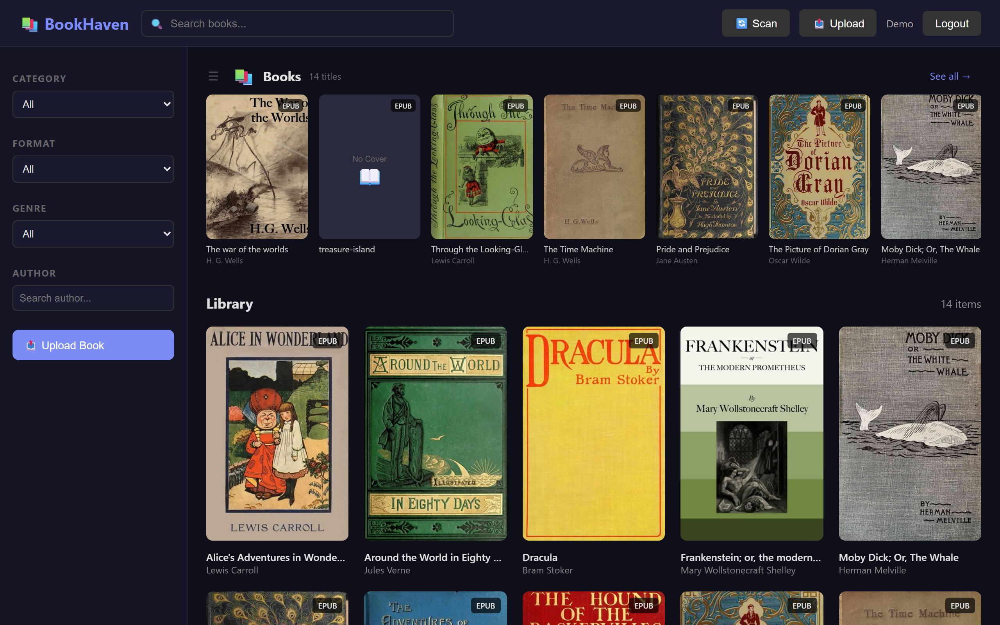
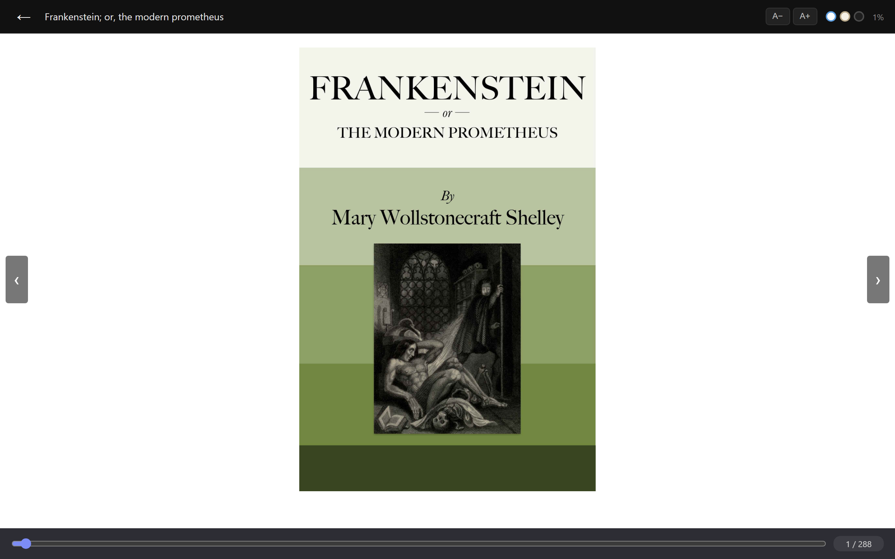
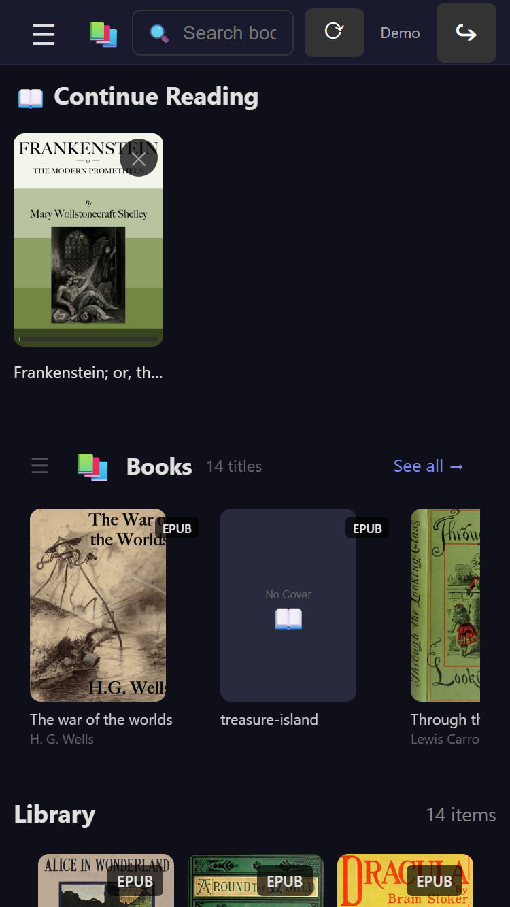

# BookHaven


A self-hosted ebook library server with in-browser readers for **EPUB, PDF,
CBZ/CBR and MOBI**, a companion **Android** client with offline reading and
progress sync, and **local-LLM genre classification**. Point it at a folder of
books, scan, and read from any device on your network.

**Status:** actively maintained, personal self-hosted project — server
**v2.8.1**, Android client **v1.9.5**. The current version is shown in the web
UI footer and returned by `GET /api/version`.

> Screenshots below are generated from a demo instance seeded exclusively with
> **public-domain books** from [Project Gutenberg](https://www.gutenberg.org/).



## Features

- **Multi-format in-browser readers** — EPUB (epub.js), PDF (PDF.js), comic
  archives CBZ/CBR (extracted page-by-page on the fly), and MOBI. Files are
  streamed from disk with HTTP range requests; no pre-conversion step.
- **Local-LLM genre classification** — books are tagged against a fixed
  taxonomy by a locally-running [Ollama](https://ollama.com/) model
  (`llama3.1`). The prompt is constrained to a closed set of genres with strict
  parsing; if Ollama isn't running, classification is simply skipped. **No book
  data ever leaves the machine.**
- **Asynchronous metadata enrichment** — a background worker extracts covers
  from the files themselves (PyMuPDF / ZIP / RAR / EPUB OPF), then falls back to
  Open Library and Google Books for covers and descriptions. Outbound fetches
  are restricted to public HTTPS hosts (SSRF-guarded).
- **Reading-progress sync** — web ↔ Android, with conflict resolution. EPUB
  position is stored as a precise CFI, not a percentage, so it survives font and
  layout changes.
- **Collections** — series and format variants of the same book are grouped
  entirely in SQL, with a parity test suite against the original Python
  implementation.
- **Responsive UI** — works from phone to desktop, with a "Continue Reading"
  shelf and a full-screen reader.

<p align="center">
  
  
</p>

## Architecture

```
┌───────────────┐   HTTP/JSON   ┌─────────────────────────────┐
│  Web browser  │──────────────▶│  Flask app (bookhaven.py)   │
│ epub.js/PDF.js│               │   ├─ database.py  (SQLite/WAL)
└───────────────┘               │   ├─ scanner.py   (library indexing)
┌───────────────┐               │   ├─ genre_ai.py  ──▶ Ollama (local LLM)
│  Android app  │──────────────▶│   └─ media_worker.py ─▶ Open Library /
│  Kotlin/Room  │  offline sync │                         Google Books (bg thread)
└───────────────┘               └─────────────────────────────┘
```

### Project layout

```
bookhaven.py        Flask app: routes, readers, auth, uploads (__version__ lives here)
config.py           Environment-driven configuration (.env via python-dotenv)
database.py         SQLite schema, WAL mode, queries (incl. SQL-side grouping)
scanner.py          Library indexing
genre_ai.py         Ollama genre classification
media_worker.py     Background cover/description enrichment
templates/, static/ Single-page web UI
android/            Kotlin Android client (Gradle)
scripts/            Server launcher, watchdog, Task Scheduler installer, maintenance tools
tests/              pytest suite (unit, security, Playwright UI)
docs/               Design notes, reports, screenshots
```

**Stack.** Python 3.12 · Flask 3 · waitress · SQLite (WAL) · PyMuPDF · Pillow ·
rarfile — Android: Kotlin, Hilt, Room, Coroutines, OkHttp/Retrofit — a Node.js
watchdog for supervised operation.

## Getting started

Requirements: **Python 3.12**. Optional: [Calibre](https://calibre-ebook.com/)
(`ebook-convert`, for PDF→EPUB), WinRAR/`UnRAR` (for CBR), and
[Ollama](https://ollama.com/) with `llama3.1` (for genre classification). Each
is optional — the server runs without them, skipping the corresponding feature.

```bash
python -m pip install -r requirements.txt

cp .env.example .env
# Generate a secret key and paste it into .env:
python -c "import secrets; print(secrets.token_hex(32))"
# Set BOOKS_ROOT in .env to your library folder.

python bookhaven.py     # serves on http://0.0.0.0:8097 via waitress
```

Open `http://localhost:8097`, pick or create a user, and click **Scan** to index
your library.

### Configuration

All configuration is via environment variables (see `.env.example`):

| Variable | Required | Purpose |
|---|---|---|
| `BOOKHAVEN_SECRET_KEY` | **yes** | Flask session key; **≥ 32 chars**. Startup fails otherwise. |
| `BOOKS_ROOT` | yes | Library root (native path, e.g. `H:\Books`). |
| `BOOKHAVEN_PORT` | no | HTTP port (default `8097`). |
| `BOOKHAVEN_LOGIN_REQUIRED` | no | `1` to require picking a user at login. Default `0`: opens straight on the library as the default user. |
| `BOOKHAVEN_DEFAULT_USER` | no | Name of the user auto-selected when login is not required. |
| `BOOKHAVEN_PIN` | no | Optional shared login PIN, used when login is required (see Security). |
| `BOOKHAVEN_COOKIE_SECURE` | no | Set `1` to mark the session cookie Secure (behind HTTPS). |
| `BOOKHAVEN_MAX_UPLOAD_MB` | no | Upload size cap (default `512`). |
| `UNRAR_TOOL` | no | Path to `UnRAR.exe` for CBR extraction. |
| `CALIBRE_CONVERT` | no | Path to `ebook-convert` for PDF→EPUB. |

To keep specific files out of the library, list glob patterns relative to
`BOOKS_ROOT` (one per line, `#` for comments) in `data/scan_exclude.txt`.
Excluded files are skipped by the scanner, and any existing entry for them is
dropped on the next scan.

## Security model

BookHaven is designed to run on a **private, trusted network** — a home LAN or a
personal VPN — not to be exposed directly to the internet.

- By default (`BOOKHAVEN_LOGIN_REQUIRED` unset) there is **no login at all**:
  the app opens on the library as `BOOKHAVEN_DEFAULT_USER`, so per-user reading
  progress still works.
- With `BOOKHAVEN_LOGIN_REQUIRED=1`, authentication is by **user selection**.
  There are **no per-user passwords**; the only optional secret is a **single
  shared PIN** (`BOOKHAVEN_PIN`), enforced at login and user creation with a
  constant-time comparison and a per-IP brute-force lockout.
- The server binds `0.0.0.0` so any device on the network can reach it.
- If you place BookHaven behind an HTTPS reverse proxy, set
  `BOOKHAVEN_COOKIE_SECURE=1`.
- **Do not expose this server directly to the public internet.**

Hardening already in place: uploads are validated by extension **and magic
bytes** and confined to the library root (no path traversal); EPUB resources are
served with a MIME allowlist so a booby-trapped EPUB can't run script on the
app's origin; outbound enrichment fetches are SSRF-guarded to public HTTPS
hosts; and security headers (CSP, `nosniff`, `X-Frame-Options`) are sent on
every response. See [`SECURITY.md`](SECURITY.md) for the threat model and known
trade-offs.

**Reporting a vulnerability:** please use a private
[GitHub security advisory](https://github.com/StephaneHe/BookHaven/security/advisories/new),
not a public issue. Secrets (`.env`), the SQLite database, logs and caches are
kept out of the repository by `.gitignore`.

## Testing

```bash
python -m pip install -r requirements-dev.txt
python -m playwright install chromium     # for the browser UI tests
python -m pytest
```

The suite includes dedicated security tests (upload validation, EPUB-resource
isolation, PIN brute-force lockout, session-cookie hardening, SSRF guard,
test-mode guard). If port `8098` is busy, set `BOOKHAVEN_TEST_PORT` to a free
port.

## Deployment (Windows)

BookHaven runs as a standalone Python process (the `Dockerfile` is a legacy
artifact and is not used). Two Windows Task Scheduler tasks supervise it:

| Task | Runs | Role |
|---|---|---|
| `BookHaven-server` | `scripts\start-server.cmd` | Starts at logon; idempotent (kills whatever holds the port, then relaunches). |
| `BookHaven-watchdog` | `node scriptsookhaven-watchdog.mjs` | Probes the server every 10 s and restarts it after 2 consecutive failures. |

Install both from an **elevated** prompt with `scripts\install-tasks.cmd`.
To stop the watchdog cleanly before maintenance, create `logs\watchdog.stop`.

The server runs with `debug=False`: any change to a `.py` file requires a
restart (`scripts\start-server.cmd`); templates reload automatically.

## Android client

A native Kotlin client lives in [`android/`](android/): library browsing,
in-app EPUB/PDF/comic readers, offline downloads, and progress sync. Enter your
server's address on first launch (plain HTTP is permitted for the private/VPN
self-hosted server via a scoped network-security config).

Build with the Gradle wrapper from `android/` (requires the Android SDK):

```bash
cd android
./gradlew assembleDebug
```

## Versioning & changelog

The project follows [Semantic Versioning](https://semver.org/). The single
source of truth is `__version__` in `bookhaven.py` (the Android app has its own
`versionName`). Every functional change bumps the version and gets an entry in
[`CHANGELOG.md`](CHANGELOG.md) ([Keep a Changelog](https://keepachangelog.com/)
format; Android changes are tracked in
[`android/CHANGELOG.md`](android/CHANGELOG.md)).

## Roadmap

Open items from the internal TODO list:

- Ensure every Flask handler reliably closes its database connection (latent bug).
- Verify rendering of very tall (~14 000 px) webtoon strips in the Android app.
- Optional: auto-advance to the next chapter at the end of a comic chapter.
- Optional: SVG "No Cover" placeholder and a "clear image cache" setting on Android.

## Contributing

This is a personal project, but issues and pull requests are welcome. Please
run `python -m pytest` before submitting, keep changes focused, and add a
`CHANGELOG.md` entry with a version bump for any functional change.

## License

[MIT](LICENSE) © 2026 Stéphane Hercot

## Author

Stéphane Hercot — [@StephaneHe](https://github.com/StephaneHe)
